# Paso 1. Verificar Base de Datos

En este paso haremos una consulta para verificar si la base de datos se ha restaurado correctamente.
```sql
  -- Verify key tables in AdventureWorksLT
 SELECT TOP (5) CustomerID, FirstName, LastName 
 FROM SalesLT.Customer;
    
 SELECT TOP (5) SalesOrderID, OrderDate, CustomerID 
 FROM SalesLT.SalesOrderHeader;
    
 SELECT TOP (5) ProductID, Name, ListPrice 
 FROM SalesLT.Product;
```
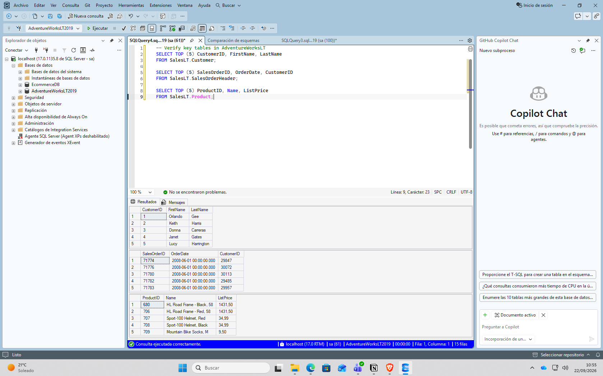

# Paso 2. Crear una view para simplificar consultas

En este paso creamos una view que combina los clientes con sus pedidos dentro del schema SalesLT.

```sql
 CREATE OR ALTER VIEW SalesLT.vCustomerOrders AS
 SELECT 
     c.CustomerID,
     CONCAT(c.FirstName, ' ', c.LastName) AS CustomerName,
     h.SalesOrderID,
     h.OrderDate
 FROM SalesLT.Customer c
 INNER JOIN SalesLT.SalesOrderHeader h ON c.CustomerID = h.CustomerID;
```

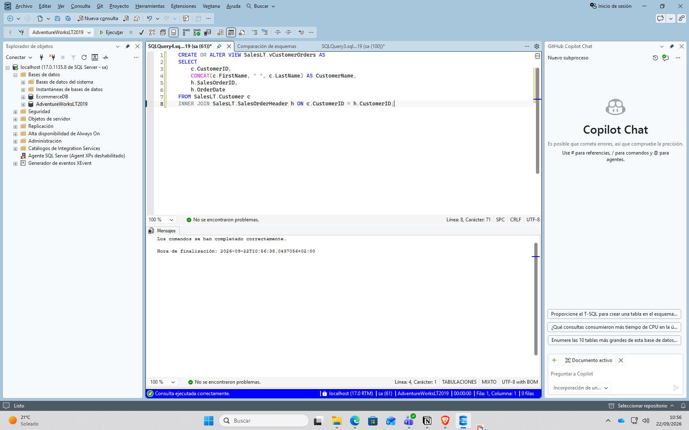

# Paso 3. Validamos que la view es correcta

En este paso comprobamos que la view devuelve hasta cinco filas con los pedidos más recientes.

```sql
  SELECT TOP (5) * 
 FROM SalesLT.vCustomerOrders 
 ORDER BY OrderDate DESC;
```

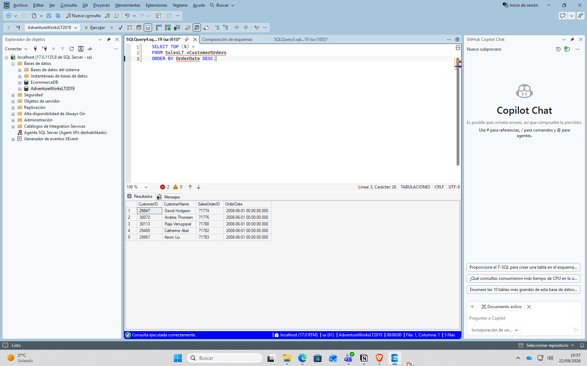

# Paso 4. Crear un stored procedure para procesar un pedido

En este paso creamos un store procedure

 ```sql
 CREATE OR ALTER PROCEDURE dbo.AddOrderLineItem
 	@SalesOrderID INT,
 	@ProductID    INT,
 	@Quantity     INT
 AS
 BEGIN
 	SET NOCOUNT ON;
 	BEGIN TRANSACTION;
    
 	-- Use Product ListPrice as UnitPrice
 	DECLARE @UnitPrice DECIMAL(18,2);
 	SELECT @UnitPrice = CAST(ListPrice AS DECIMAL(18,2))
 	FROM SalesLT.Product
 	WHERE ProductID = @ProductID;
    
 	IF @UnitPrice IS NULL
 	BEGIN
 		ROLLBACK TRANSACTION;
 		THROW 50010, 'Invalid ProductID specified.', 1;
 	END
    
 	-- Ensure SalesOrderID exists
 	IF NOT EXISTS (SELECT 1 FROM SalesLT.SalesOrderHeader WHERE SalesOrderID = @SalesOrderID)
 	BEGIN
 		ROLLBACK TRANSACTION;
 		THROW 50011, 'Invalid SalesOrderID specified.', 1;
 	END
    
 	-- Insert line item (no discount)
 	INSERT INTO SalesLT.SalesOrderDetail (SalesOrderID, OrderQty, ProductID, UnitPrice, UnitPriceDiscount)
 	VALUES (@SalesOrderID, @Quantity, @ProductID, @UnitPrice, 0);
    
 	-- Update header subtotal based on current line totals
 	UPDATE h
 	SET SubTotal = d.SumLineTotal,
 		ModifiedDate = SYSUTCDATETIME()
 	FROM SalesLT.SalesOrderHeader h
 	INNER JOIN (
 		SELECT SalesOrderID, SUM(LineTotal) AS SumLineTotal
 		FROM SalesLT.SalesOrderDetail
 		WHERE SalesOrderID = @SalesOrderID
 		GROUP BY SalesOrderID
 	) d ON d.SalesOrderID = h.SalesOrderID;
    
 	COMMIT TRANSACTION;
 END;
```

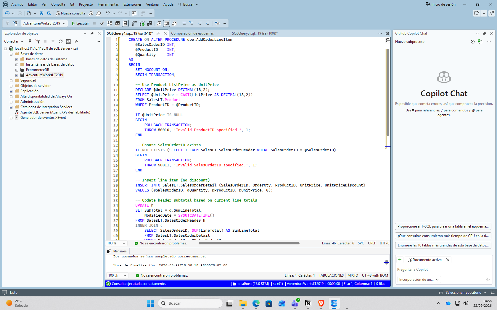

# Paso 5. Probamos que el stored procedure se ha creado correctamente

En este paso realizamos una consulta para comprobar el stored procedure

```sql
  -- Add a line item to an existing order (choose a valid SalesOrderID)
 DECLARE @SalesOrderID INT = (SELECT TOP 1 SalesOrderID 
                             FROM SalesLT.SalesOrderHeader 
                             ORDER BY SalesOrderID DESC);
 EXEC dbo.AddOrderLineItem @SalesOrderID = @SalesOrderID,         
                             @ProductID = 680, 
                             @Quantity = 1; -- adjust ProductID as needed
    
 SELECT TOP (5) * 
 FROM SalesLT.SalesOrderDetail 
 WHERE SalesOrderID = @SalesOrderID 
 ORDER BY SalesOrderDetailID DESC;

 SELECT SalesOrderID, SubTotal, TaxAmt, Freight, TotalDue 
 FROM SalesLT.SalesOrderHeader 
 WHERE SalesOrderID = @SalesOrderID;
```

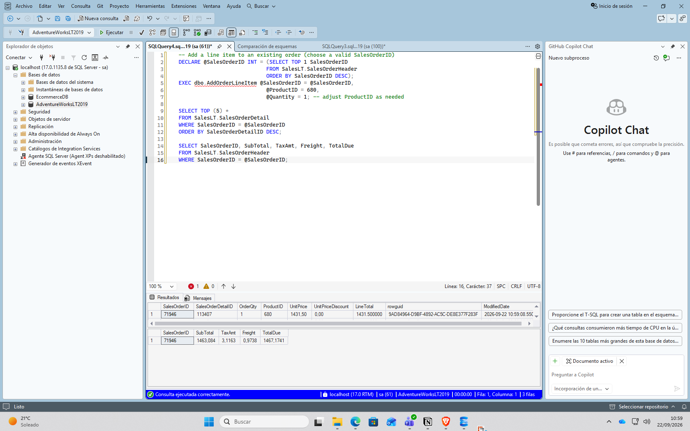

# Paso 6. Crear una scalar function para cálculos reutilizables

En este paso crearemos un scalar function que devolverá el valor total de un pedido utilizando los LineTotal de AdventureWorksLT.

```sql
     CREATE OR ALTER FUNCTION dbo.fnOrderTotal (@OrderID INT)
     RETURNS DECIMAL(18,2)
     AS
     BEGIN
     	DECLARE @Total DECIMAL(18,2);

     	SELECT @Total = SUM(LineTotal)
     	FROM SalesLT.SalesOrderDetail
     	WHERE SalesOrderID = @OrderID;

     	RETURN ISNULL(@Total, 0.00);
     END;
```

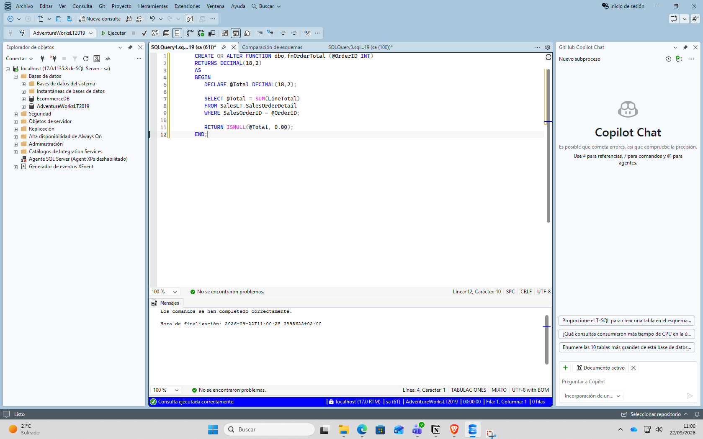

# Paso 7. Utilizar scalar function

En este paso utilizaremos el scalar function que hemos creado.

```sql
 SELECT d.SalesOrderID, dbo.fnOrderTotal(d.SalesOrderID) AS OrderTotal
 FROM SalesLT.SalesOrderDetail d
 GROUP BY d.SalesOrderID
 ORDER BY d.SalesOrderID DESC;
```

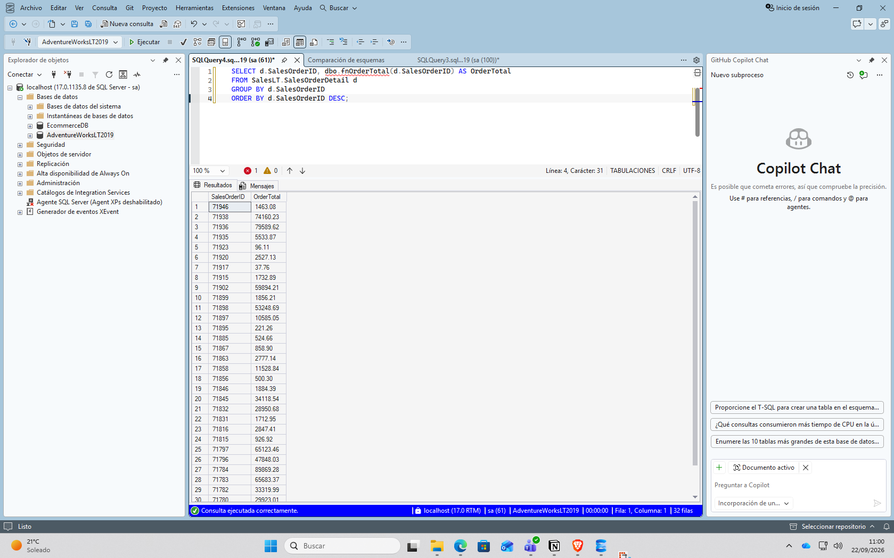

# Paso 8. Crear una inline table-valued function (TVF)

En este paso creamos una inline table-valued function que devolverá los pedidos de un determinado cliente.

```sql
  CREATE OR ALTER FUNCTION dbo.GetCustomerOrders (@CustomerID INT)
 RETURNS TABLE
 AS
 RETURN
 (
 	SELECT 
 		h.SalesOrderID,
 		h.OrderDate
 	FROM SalesLT.SalesOrderHeader h
 	WHERE h.CustomerID = @CustomerID
 );
```

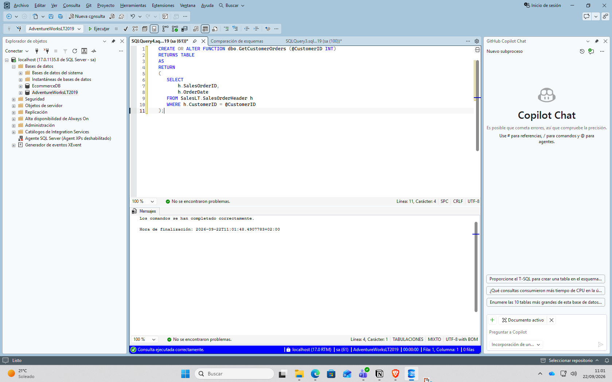

# Paso 9. Consultar TVF

En este paso consultamos la table-valued function

```sql
  SELECT * 
 FROM dbo.GetCustomerOrders(29929)
 ORDER BY OrderDate DESC;
```

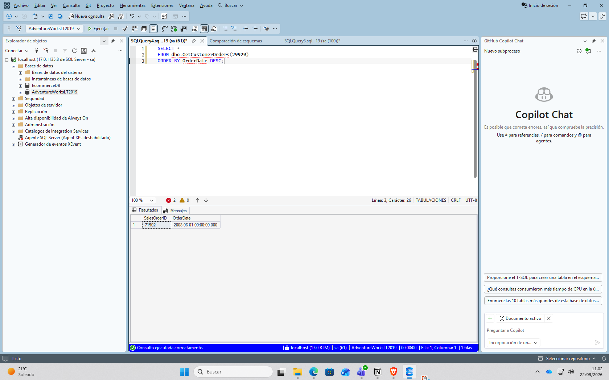

# Paso 10. Combinar TVF con clientes

En este paso combinaremos table-valued function con los clientes.

```sql
  SELECT CONCAT(c.FirstName, ' ', c.LastName) AS CustomerName, o.SalesOrderID, o.OrderDate
 FROM SalesLT.Customer c
     CROSS APPLY dbo.GetCustomerOrders(c.CustomerID) o
 WHERE c.CustomerID = 29929;
```

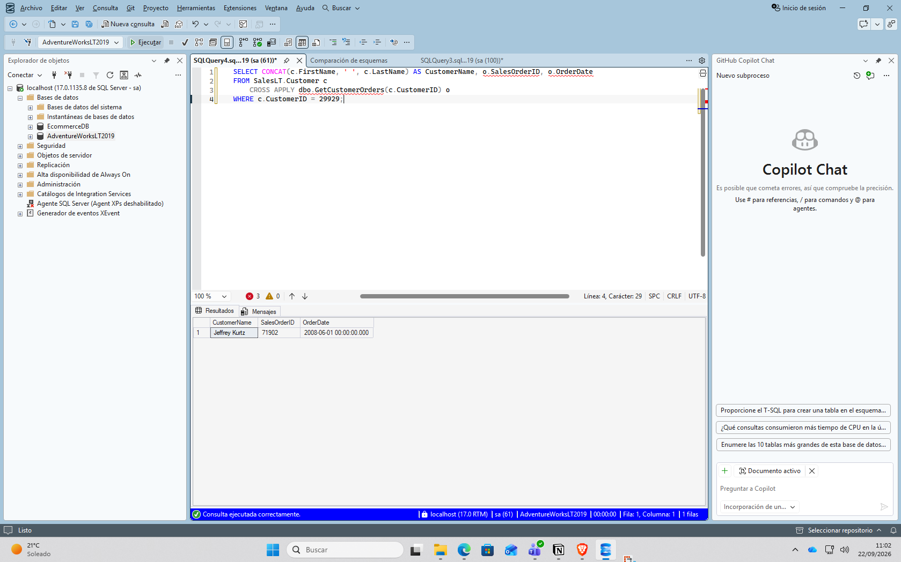


# Paso 11. Crear un trigger para registrar cambios

En este paso añadiremos un trigger que registre cambios en los totales de los pedidos cuando cambien los detalles de los pedidos de SalesLT.

```sql
  -- Audit table
 IF OBJECT_ID('dbo.OrderAudit') IS NULL
 BEGIN
     CREATE TABLE dbo.OrderAudit (
         AuditID     INT IDENTITY(1,1) PRIMARY KEY,
         OrderID     INT NOT NULL,
         OldTotal    DECIMAL(18,2) NULL,
         NewTotal    DECIMAL(18,2) NULL,
         ChangedAt   DATETIME2 NOT NULL DEFAULT SYSUTCDATETIME()
     );
 END
 GO

 -- Trigger on order details updates
 CREATE OR ALTER TRIGGER SalesLT.trg_LogOrderTotalChange
 ON SalesLT.SalesOrderDetail
 AFTER INSERT, UPDATE
 AS
 BEGIN
     SET NOCOUNT ON;

     ;WITH AffectedOrders AS (
         SELECT SalesOrderID FROM inserted
         UNION
         SELECT SalesOrderID FROM deleted
     ),
     -- New totals from the base table (already reflects changes)
     NewTotals AS (
         SELECT d.SalesOrderID, SUM(d.OrderQty * d.UnitPrice) AS Total
         FROM SalesLT.SalesOrderDetail d
         INNER JOIN AffectedOrders a ON d.SalesOrderID = a.SalesOrderID
         GROUP BY d.SalesOrderID
     ),
     -- Contribution of the newly inserted/updated rows
     InsertedTotals AS (
         SELECT SalesOrderID, SUM(OrderQty * UnitPrice) AS Total
         FROM inserted
         GROUP BY SalesOrderID
     ),
     -- Contribution of the previous row versions (empty on INSERT)
     DeletedTotals AS (
         SELECT SalesOrderID, SUM(OrderQty * UnitPrice) AS Total
         FROM deleted
         GROUP BY SalesOrderID
     )
     INSERT INTO dbo.OrderAudit (OrderID, OldTotal, NewTotal)
     SELECT
         n.SalesOrderID,
         n.Total - ISNULL(i.Total, 0) + ISNULL(d.Total, 0) AS OldTotal,
         n.Total AS NewTotal
     FROM NewTotals n
     LEFT JOIN InsertedTotals i ON n.SalesOrderID = i.SalesOrderID
     LEFT JOIN DeletedTotals d ON n.SalesOrderID = d.SalesOrderID;
 END;
```

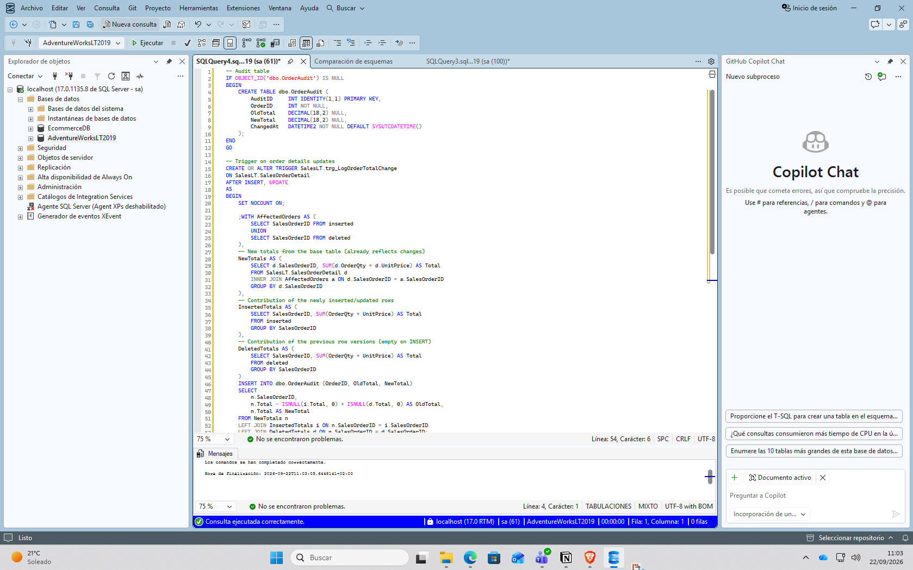

# Paso 12. Comprobar que funciona el trigger

En este paso se comprobará si el trigger funciona.

```sql
 -- Update an order detail to change the total
 UPDATE d
 SET OrderQty = OrderQty + 1
 FROM SalesLT.SalesOrderDetail d
 WHERE d.SalesOrderID = (SELECT TOP 1 SalesOrderID FROM SalesLT.SalesOrderHeader ORDER BY SalesOrderID DESC);
    
 SELECT TOP (5) * 
 FROM dbo.OrderAudit 
 ORDER BY AuditID DESC;
```

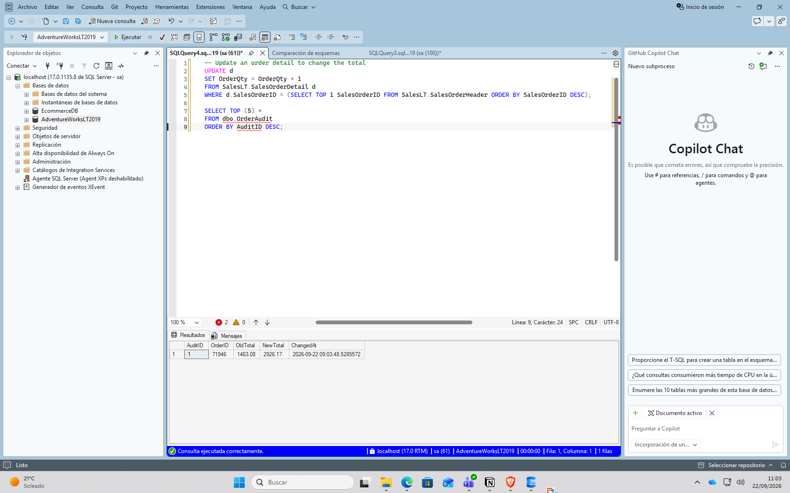

